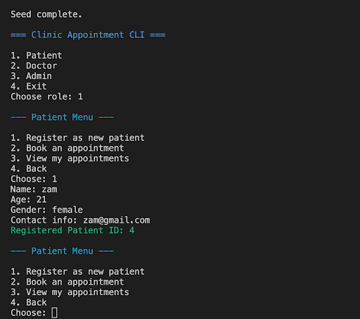

 Author
 
Abdirahman Dagane

 Clinic Appointment CLI
 
A simple command-line interface (CLI) application for managing a clinic’s appointments, patients, and doctors.
 This project simulates how patients, doctors, and admins interact in a healthcare setting.

 Features
 
 Patients

Book appointments with doctors at a specific time.

 Doctors

View scheduled appointments.

 Admin

Manage patients, doctors, and appointments.

View all clinic records in an organized way.

 Tech Stack
 
Python 3 – Core programming language

SQLite3 – Database for storing patients, doctors, and appointments

CLI – Simple text-based interface

 Project Structure
clinic-appointment-cli/
│── main.py             │── database.py          │── models.py           Doctor, Appointment classes
│── clinic.db           │── README.md           

 How to Run
Clone this repository or create the files manually.

          https://github.com/daganeabdul/clinic_appointment_cli.git
cd clinic-appointment-cli

Run the program:

  Package           Version
----------------- -------
alembic           1.16.5

colorama          0.4.6

iniconfig         2.1.0

Mako              1.3.10

MarkupSafe        3.0.2

packaging         25.0

pip               25.2

pluggy            1.6.0

Pygments          2.19.2

pytest            8.4.1

SQLAlchemy        2.0.43

tabulate          0.9.0

typing_extensions 4.15.0

    pipenv install
    pipenv shell
    python main.py

or Directly run 

     pipenv run python main.py

    

Follow the menu prompts:

Choose whether you are Admin, Doctor, or Patient.

Perform actions like booking an appointment, viewing schedules, or managing records.

  Database Schema
  
The app uses SQLite3 with 3 tables:

Patients

id (Primary Key)

name

age

gender

Doctors

id (Primary Key)

name

specialization

Appointments

id (Primary Key)

patient_id (Foreign Key → Patients.id)

doctor_id (Foreign Key → Doctors.id)

date

time

  Example Workflow
Patient books appointment with Dr. Ali at 10:00 AM, 1st Sept 2025.

Doctor checks their schedule → sees appointment with Patient A.

Admin views all records → confirms patients, doctors, and appointments are stored correctly.

   

   

MIT License

Copyright (c) 2025 daganeabdul

Permission is hereby granted, free of charge, to any person obtaining a copy
of this software and associated documentation files (the "Software"), to deal
in the Software without restriction, including without limitation the rights
to use, copy, modify, merge, publish, distribute, sublicense, and/or sell
copies of the Software, and to permit persons to whom the Software is
furnished to do so, subject to the following conditions:

The above copyright notice and this permission notice shall be included in all
copies or substantial portions of the Software.

THE SOFTWARE IS PROVIDED "AS IS", WITHOUT WARRANTY OF ANY KIND, EXPRESS OR
IMPLIED, INCLUDING BUT NOT LIMITED TO THE WARRANTIES OF MERCHANTABILITY,
FITNESS FOR A PARTICULAR PURPOSE AND NONINFRINGEMENT. IN NO EVENT SHALL THE
AUTHORS OR COPYRIGHT HOLDERS BE LIABLE FOR ANY CLAIM, DAMAGES OR OTHER
LIABILITY, WHETHER IN AN ACTION OF CONTRACT, TORT OR OTHERWISE, ARISING FROM,
OUT OF OR IN CONNECTION WITH THE SOFTWARE OR THE USE OR OTHER DEALINGS IN THE
SOFTWARE.

